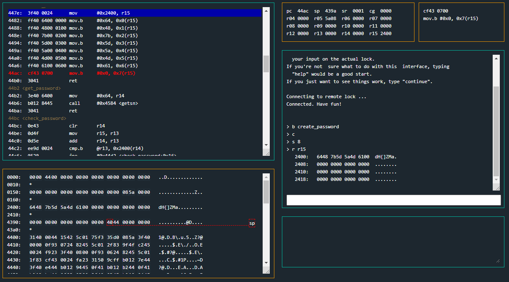
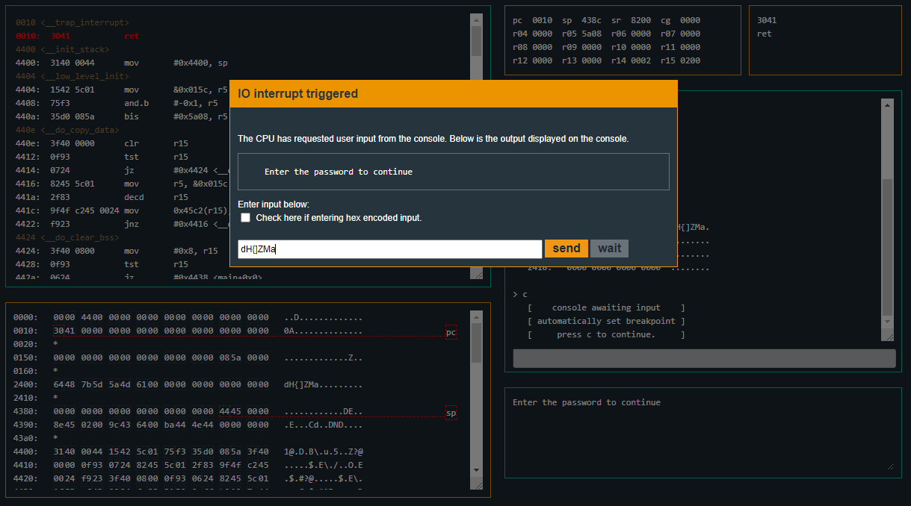
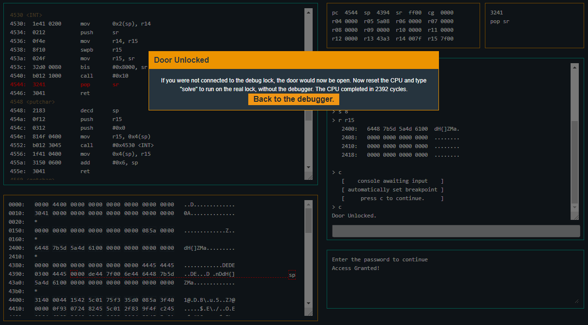
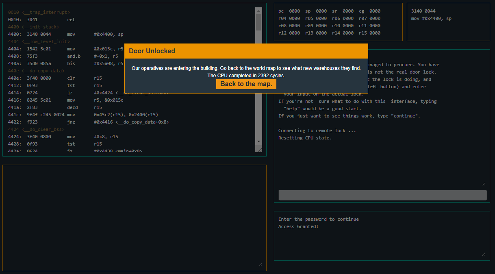

# Microcorruption: New Orleans
  
\


## Description
```
Lockitall                                            LOCKIT PRO r a.01
______________________________________________________________________

              User Manual: Lockitall LockIT Pro, rev a.01              
______________________________________________________________________


OVERVIEW

    - This is the first LockIT Pro Lock.
    - This lock is not attached to any hardware security module.


DETAILS

    The LockIT Pro a.01  is the first of a new series  of locks. It is
    controlled by a  MSP430 microcontroller, and is  the most advanced
    MCU-controlled lock available on the  market. The MSP430 is a very
    low-power device which allows the LockIT  Pro to run in almost any
    environment.

    The  LockIT  Pro   contains  a  Bluetooth  chip   allowing  it  to
    communiciate with the  LockIT Pro App, allowing the  LockIT Pro to
    be inaccessable from the exterior of the building.

    There is  no default password  on the LockIT  Pro---upon receiving
    the LockIT Pro, a new password must be set by connecting it to the
    LockIT Pro  App and  entering a password  when prompted,  and then
    restarting the LockIT Pro using the red button on the back.
    
    This is Hardware  Version A.  It contains  the Bluetooth connector
    built in, and one available port  to which the LockIT Pro Deadbolt
    should be connected.

    This is Software Revision 01.

    


(c) 2013 LOCKITALL                                            Page 1/1
```

## Attached files
- [NewOrleans.txt](NewOrleans.txt)

## Summary
We have to reverse the code to determine the password used to unlock the door.

## Flag
```
dH{]ZMa
```

## Detailed solution
We can start by taking a look at the `<main>` function. We can see that the first thing the function does is call the `<create_password>` function at the address `0x447e`. While looking at the `<create_password>` function, we can see that it inserts hexadecimal values into the register 15 (r15) at specific locations in order. We can than convert those hexadecimal values to ASCII which gives us the created password.

We can start by setting a breakpoint at the `<create_password>` function by entering the command:
```
b = create_password
```

After that we can start the execution of the program, step through the mov instructions all the way to the last mov instruction since the last one inserts a null byte at the end and finish by reading what's in the `register r15`. We can do all of this by entering the following commands:
```
> c
> s 8
> r r15
```

The output when we `read r15` is:
```
> r r15
   2400:   6448 7b5d 5a4d 6100  dH{]ZMa.
   2408:   0000 0000 0000 0000  ........
   2410:   0000 0000 0000 0000  ........
   2418:   0000 0000 0000 0000  ........
```

We see that the password created is `dH{]ZMa`. We can then enter the command continue, let the function `<check_password>` check our password.
```
> c
```


After confirming that our password is correct, we can enter the command `solve` and enter the password to unlock the door and complete the challenge:
```
> solve
```
