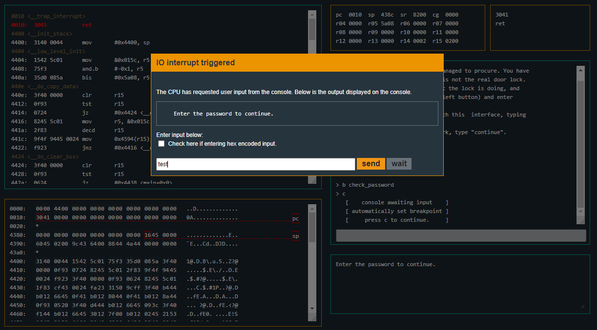
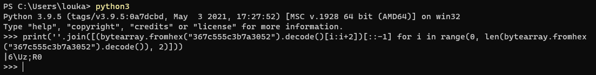
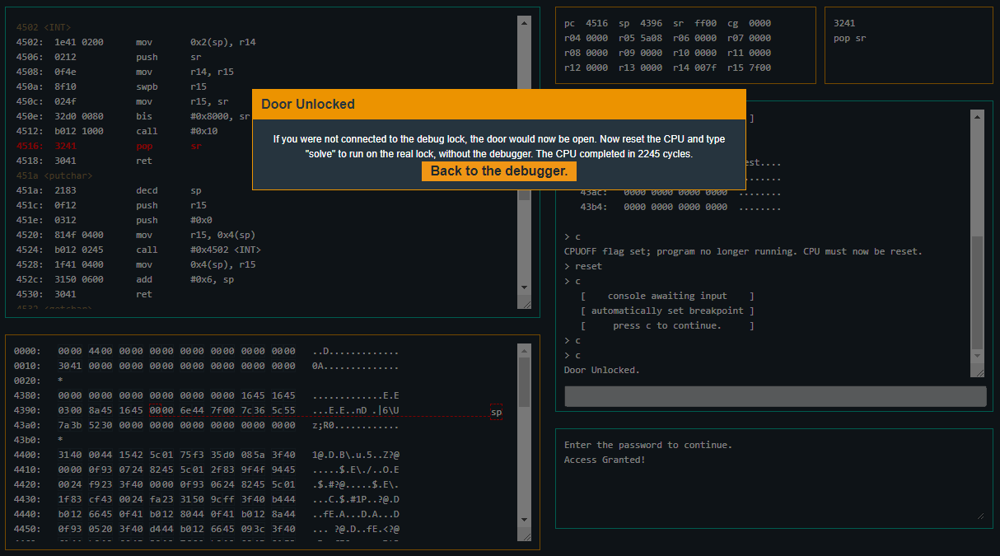
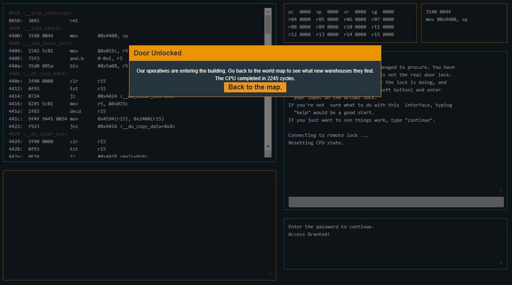

# Microcorruption: New Orleans
  
\


## Description
```
Lockitall                                            LOCKIT PRO r a.02
______________________________________________________________________

              User Manual: Lockitall LockIT Pro, rev a.02              
______________________________________________________________________


OVERVIEW

    - We have revised the software in revision 02.
    - This lock is not attached to any hardware security module.


DETAILS

    The LockIT Pro a.02  is the first of a new series  of locks. It is
    controlled by a  MSP430 microcontroller, and is  the most advanced
    MCU-controlled lock available on the  market. The MSP430 is a very
    low-power device which allows the LockIT  Pro to run in almost any
    environment.

    The  LockIT  Pro   contains  a  Bluetooth  chip   allowing  it  to
    communiciate with the  LockIT Pro App, allowing the  LockIT Pro to
    be inaccessable from the exterior of the building.

    There is  no default password  on the LockIT  Pro---upon receiving
    the LockIT Pro, a new password must be set by connecting it to the
    LockIT Pro  App and  entering a password  when prompted,  and then
    restarting the LockIT Pro using the red button on the back.
    
    This is Hardware  Version A.  It contains  the Bluetooth connector
    built in, and one available port  to which the LockIT Pro Deadbolt
    should be connected.

    This is  Software Revision 02.  We have received reports  that the
    prior  version of  the  lock was  bypassable  without knowing  the
    password. We have fixed this and removed the password from memory.

    


(c) 2013 LOCKITALL                                            Page 1/1
```

## Attached files
- [Sydney.txt](Sydney.txt) (Deassembly code)
- [solve.py](solve.py)

## Summary
We have to reverse the code to determine the password used to unlock the door.

## Flag
```
|6\Uz;R0
```

## Detailed solution
We can start by checking the dissambly code. In the `<main>` function, we call the `<get_password>`, which when looking at it, we can see that it takes our input and then returns it to after get stored in the r15 register. We see that there's also a `<check_password>` function like in the New Orleans challenge. This time, `<check_password>` compares parts of what's in the register r15 with hexadecimal values and then evaluates it with conditional jumps like `jnz` (Jump Not Zero) and `jne` (Jump Not Equal). 
```
4438 <main>
4438:  3150 9cff      add	#0xff9c, sp
443c:  3f40 b444      mov	#0x44b4 "Enter the password to continue.", r15
4440:  b012 6645      call	#0x4566 <puts>
4444:  0f41           mov	sp, r15
4446:  b012 8044      call	#0x4480 <get_password>
444a:  0f41           mov	sp, r15
444c:  b012 8a44      call	#0x448a <check_password>
4450:  0f93           tst	r15
4452:  0520           jnz	#0x445e <main+0x26>
4454:  3f40 d444      mov	#0x44d4 "Invalid password; try again.", r15
4458:  b012 6645      call	#0x4566 <puts>
445c:  093c           jmp	#0x4470 <main+0x38>
445e:  3f40 f144      mov	#0x44f1 "Access Granted!", r15
4462:  b012 6645      call	#0x4566 <puts>
4466:  3012 7f00      push	#0x7f
446a:  b012 0245      call	#0x4502 <INT>
446e:  2153           incd	sp
4470:  0f43           clr	r15
4472:  3150 6400      add	#0x64, sp
```
```
448a <check_password>
448a:  bf90 7c36 0000 cmp	#0x367c, 0x0(r15)
4490:  0d20           jnz	$+0x1c
4492:  bf90 5c55 0200 cmp	#0x555c, 0x2(r15)
4498:  0920           jnz	$+0x14
449a:  bf90 7a3b 0400 cmp	#0x3b7a, 0x4(r15)
44a0:  0520           jne	#0x44ac <check_password+0x22>
44a2:  1e43           mov	#0x1, r14
44a4:  bf90 5230 0600 cmp	#0x3052, 0x6(r15)
44aa:  0124           jeq	#0x44ae <check_password+0x24>
44ac:  0e43           clr	r14
44ae:  0f4e           mov	r14, r15
44b0:  3041           ret
```
We'll start by setting a breakpoint at `<check_password>` to step through the instructions and see what happens. We enter the command:
```
> b check_password
```

After that, we can enter the command `continue` and enter a password and see what happens once we reach the `<check_password>` function:
```
> c
   [    console awaiting input    ]
   [ automatically set breakpoint ]
   [     press c to continue.     ]
```


We can the continue through the execution to reach the `<check_password>` function. Once we're there, we can check what's in r15. Here's the commands and outputs of the commands:
```
> c
> r r15
   439c:   7465 7374 0000 0000  test....
   43a4:   0000 0000 0000 0000  ........
   43ac:   0000 0000 0000 0000  ........
   43b4:   0000 0000 0000 0000  ........
```
We see that `test` is stored in the register r15. We can now look through the `<check_password>` function to see what it does. It compares parts of what's in the register 15 with hexadecimal values. We see that we want to set a `zero flag` with the `cmp` instruction so we can skip all the three `jnz` and `jne` conditional jumps and reach the `jeq` jump. That's gonna give us our password. We have to remember that it's in little-endian by the way.
```
448a <check_password>
448a:  bf90 7c36 0000 cmp	#0x367c, 0x0(r15)
4490:  0d20           jnz	$+0x1c
4492:  bf90 5c55 0200 cmp	#0x555c, 0x2(r15)
4498:  0920           jnz	$+0x14
449a:  bf90 7a3b 0400 cmp	#0x3b7a, 0x4(r15)
44a0:  0520           jne	#0x44ac <check_password+0x22>
44a2:  1e43           mov	#0x1, r14
44a4:  bf90 5230 0600 cmp	#0x3052, 0x6(r15)
44aa:  0124           jeq	#0x44ae <check_password+0x24>
44ac:  0e43           clr	r14
44ae:  0f4e           mov	r14, r15
44b0:  3041           ret
```
The three hexadecimal values we need are `0x367c`, `0x555c`, `0x3b7a` and `0x3052`. It gives us `367c555c3b7a3052`, but since it's in big-endian and we need it in little-endian, we have to read it from left to right. So it actually gives us `7c365c557a3b5230`. I wrote a quick python script to convert the hexadecimal values to utf-8 and change the order from big-endian to little-endian (so we can use the hex values we get from reading from the left to the right instead of the right to the left):
``` python
hexvalues = "367c555c3b7a3052"
password = ''.join([(bytearray.fromhex(hexvalues).decode()[i:i+2])[::-1] for i in range(0, len(bytearray.fromhex(hexvalues).decode()), 2)])
print("The password is: ", password)
```
<p style="width:100%;text-align:center;">** SIMPLE ONE LINER VERSION **</p>

``` python
print(''.join([(bytearray.fromhex("367c555c3b7a3052").decode()[i:i+2])[::-1] for i in range(0, len(bytearray.fromhex("367c555c3b7a3052").decode()), 2)]))
```

We can now directly reset the CPU and try entering the password we found. The password `|6\Uz;R0` that we found indeed works. We can now enter the `c` and `reset` commands to go test the password:
```
> c
CPUOFF flag set; program no longer running. CPU must now be reset.
> reset
> c
   [    console awaiting input    ]
   [ automatically set breakpoint ]
   [     press c to continue.     ]
```
At that point, we have the IO interrupt triggered to enter our password. We enter `|6\Uz;R0` and then enter the command `c` a couple times to finish the execution of the program and we can see that the password works:
```
> c
> c
Door Unlocked.
```

We now enter the command `solve` to unlock the door and complete the challenge by using the password `|6\Uz;R0`:
```
> solve
```
